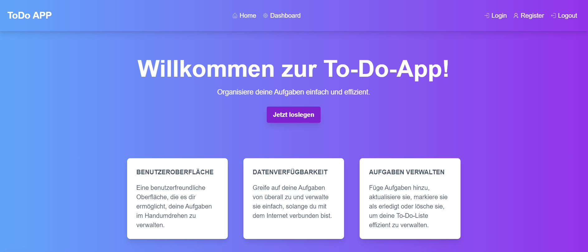
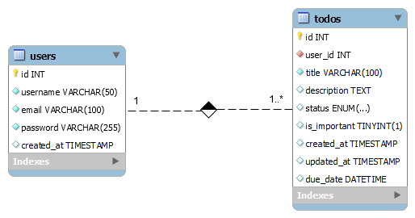

# To-Do Listen App


<div style="display: flex; justify-content: center; margin-top: 20px; margin-bottom: 40px;">
        
    </div>

    
Eine einfache To-Do-Listen-App, die es Benutzern ermöglicht, ihre Aufgaben zu verwalten. Die App unterstützt Benutzerregistrierung, Anmeldung und verwendet JWT (JSON Web Tokens) für die Authentifizierung. Entwickelt mit Next.js, Tailwind CSS und einer MySQL-Datenbank.

- **Benutzerregistrierung und -anmeldung:** Benutzer können Konten erstellen und sich anmelden.
- **Aufgaben verwalten:** Aufgaben können hinzugefügt, gelöscht und aktualisiert werden.
- **JWT-Authentifizierung:** Sicherstellung der Benutzersitzung mithilfe von JSON Web Tokens.
- **Responsives Design:** Benutzeroberfläche, die auf verschiedenen Geräten gut aussieht, dank Tailwind CSS.


## Technologien

- **Frontend:** Next.js
- **Styling:** Tailwind CSS
- **Backend:** Express.js
- **Datenbank:** MySQL
- **Authentifizierung:** JWT (JSON Web Tokens) mit bcrypt für Passwort-Hashing

## Dashboard

### 1. Übersicht

Die Übersicht bietet eine Zusammenfassung wichtiger Informationen, damit der Benutzer schnell einen Überblick über seinen Status und relevante Daten erhält.

**Inhalte für die Übersicht:**

- **Statistiken:**

  - Anzahl der aktiven Aufgaben (z. B. "5 offene Aufgaben").
  - Fortschritt in Prozent für abgeschlossene Aufgaben oder Projekte.
  - Letzte Aktivität (z. B. "Du hast zuletzt am 3. November 2 Aufgaben abgeschlossen").

- **Widgets:**

  - Schnelle Links oder Buttons zu häufig genutzten Funktionen, wie "Neue Aufgabe hinzufügen".

- **Diagramme:**

  - Grafische Darstellungen von Daten (z. B. Balkendiagramme für wöchentliche oder monatliche Fortschritte).

- **To-Do-Liste:**
  - Eine schnelle Übersicht über die wichtigsten Aufgaben.

### 2. Aufgaben

In der Aufgabenansicht können Benutzer ihre Aufgaben verwalten. Hier kannst du Funktionen zur Erstellung, Bearbeitung und Löschung von Aufgaben anbieten.

**Inhalte für die Aufgaben:**

- **Aufgabenliste:**

  - Eine vollständige Liste aller Aufgaben mit Status (offen, in Bearbeitung, abgeschlossen).

- **Such- und Filterfunktionen:**

  - Ermögliche den Benutzern, Aufgaben nach Fälligkeitsdatum zu filtern.

- **Aufgabenerstellung:**

  - Ein Formular zur Erstellung neuer Aufgaben erstellen, das die folgenden Felder umfasst:

    - **Titel**: Ein Textfeld für den Titel der Aufgabe.
    - **Beschreibung**: Ein Textbereich für eine detaillierte Beschreibung.
    - **Fälligkeitsdatum**: Ein Datumsfeld, um das Fälligkeitsdatum auszuwählen.

- **Aufgabendetails:**
  - Möglichkeit, Aufgaben zu bearbeiten, Details anzusehen.

### 3. Einstellungen

In den Einstellungen können Benutzer ihre Kontoinformationen und Präferenzen anpassen.

**Inhalte für die Einstellungen:**

- **Benutzerdaten:**

  - Anzeige und Bearbeitung von Benutzerdaten wie Benutzername und E-Mail-Adresse.

- **Passwortänderung:**
  - Möglichkeit zur Änderung des Passworts.

## Datenbankschema

### 1. Datenbank erstellen und nutzen

```sql
-- DB löschen, falls notwendig
-- DROP DATABASE todo_app;

-- Datenbank erstellen, falls sie noch nicht existiert
CREATE DATABASE IF NOT EXISTS todo_app;

-- Wechsel zur neu erstellten Datenbank
USE todo_app;
```

### 2. Tabelle für Benutzer (`users`)

```sql
-- Tabelle für Benutzer erstellen, falls sie nicht existiert
CREATE TABLE IF NOT EXISTS users (
    id INT AUTO_INCREMENT PRIMARY KEY,
    username VARCHAR(50) NOT NULL UNIQUE,
    email VARCHAR(100) NOT NULL UNIQUE,
    password VARCHAR(255) NOT NULL,
    created_at TIMESTAMP DEFAULT CURRENT_TIMESTAMP
);
```

### 3. Tabelle für To-Do-Aufgaben (`todos`)

```sql
-- Tabelle für To-Do-Aufgaben erstellen, falls sie nicht existiert
CREATE TABLE IF NOT EXISTS todos (
    id INT AUTO_INCREMENT PRIMARY KEY,
    user_id INT NOT NULL,
    title VARCHAR(100) NOT NULL,
    description TEXT,
    status ENUM('offen', 'in Bearbeitung', 'abgeschlossen') DEFAULT 'offen',
    created_at TIMESTAMP DEFAULT CURRENT_TIMESTAMP,
    updated_at TIMESTAMP DEFAULT CURRENT_TIMESTAMP ON UPDATE CURRENT_TIMESTAMP,
    due_date DATETIME,
    FOREIGN KEY (user_id) REFERENCES users(id) ON DELETE CASCADE
);
```

### 4. Dummy-Daten für die Tabelle `users` einfügen

```sql
-- Dummy-Daten für die Tabelle users einfügen
INSERT INTO users (username, email, password, created_at) VALUES
('maxmustermann', 'max@example.com', '$2b$10$KIXO8m3.NFqKX0cI5YX7zeKtdh3V7oe5kZm1frXlHt60L1aABN5Z6', NOW()), -- Passwort: "password123"
('johndoe', 'john@example.com', '$2b$10$KIXO8m3.NFqKX0cI5YX7zeKtdh3V7oe5kZm1frXlHt60L1aABN5Z6', NOW()),   -- Passwort: "password123"
('janedoe', 'jane@example.com', '$2b$10$KIXO8m3.NFqKX0cI5YX7zeKtdh3V7oe5kZm1frXlHt60L1aABN5Z6', NOW());   -- Passwort: "password123"
```

### 5. Dummy-Daten für die Tabelle `todos` einfügen

```sql
-- Dummy-Daten für die Tabelle todos einfügen
INSERT INTO todos (user_id, title, description, status, due_date, created_at, updated_at) VALUES
(1, 'Einkaufen gehen', 'Milch, Brot, Eier und Obst kaufen.', 'offen', '2024-11-10 18:00:00', NOW(), NOW()),
(1, 'Hausaufgaben machen', 'Mathe und Englisch Hausaufgaben fertigstellen.', 'in Bearbeitung', '2024-11-05 17:00:00', NOW(), NOW()),
(2, 'Fitnessstudio', 'Im Fitnessstudio trainieren.', 'offen', '2024-11-07 19:00:00', NOW(), NOW()),
(2, 'Projekte abschließen', 'Abschlussbericht für das Projekt fertigstellen.', 'abgeschlossen', '2024-11-03 15:00:00', NOW(), NOW()),
(3, 'Arzttermin', 'Zur Arztpraxis gehen für die jährliche Untersuchung.', 'offen', '2024-11-12 09:00:00', NOW(), NOW()),
(3, 'Küche putzen', 'Die Küche gründlich reinigen.', 'offen', '2024-11-09 12:00:00', NOW(), NOW());
```

### 6. Daten aus den Tabellen abfragen

```sql
-- Abfrage aller Benutzer
SELECT * FROM users;

-- Abfrage aller To-Do-Aufgaben
SELECT * FROM todos;
```

### 7. ER-Diagramm (Entity-Relationship-Diagramm)

Das Entity-Relationship-Diagramm (ER-Diagramm) stellt die Struktur der Datenbank visuell dar und zeigt die verschiedenen Entitäten (Tabellen) sowie deren Beziehungen zueinander auf. In unserer To-Do-Listen-App umfasst das ER-Diagramm die folgenden Hauptkomponenten:

1. **Entitäten**:

   - **users**: Diese Tabelle repräsentiert die Benutzer der App. Sie enthält relevante Informationen wie die Benutzer-ID, Benutzernamen, E-Mail-Adressen und gehashte Passwörter. Jeder Benutzer hat eine eindeutige Identität, die durch die `id`-Spalte definiert wird.
   - **todos**: Diese Tabelle enthält die Aufgaben der Benutzer. Jede Aufgabe ist mit einem spezifischen Benutzer verknüpft (durch die `user_id`) und enthält Informationen wie den Titel, die Beschreibung, den Status der Aufgabe (offen, in Bearbeitung, abgeschlossen), das Fälligkeitsdatum sowie Zeitstempel für die Erstellung und letzte Aktualisierung.

2. **Beziehungen**:

   - Die Beziehung zwischen der `users`-Tabelle und der `todos`-Tabelle ist eine **1:n-Beziehung** (eins zu viele). Dies bedeutet, dass ein Benutzer mehrere Aufgaben haben kann, während jede Aufgabe genau einem Benutzer zugeordnet ist. Die `user_id`-Spalte in der `todos`-Tabelle fungiert als Fremdschlüssel und verweist auf die `id`-Spalte in der `users`-Tabelle. Dies gewährleistet die referenzielle Integrität der Daten und ermöglicht es, Aufgaben zu einem spezifischen Benutzer zuzuordnen.

3. **Diagramm**:

   - Das ER-Diagramm visualisiert diese Entitäten und ihre Beziehungen, was eine klare Übersicht über die Datenbankstruktur bietet. Es zeigt die Attribute jeder Entität und illustriert, wie die Entitäten miteinander verbunden sind.

   - <div style="display: flex; justify-content: center; margin-top: 20px; margin-bottom: 40px;">
         
     </div>

## Weiterführende Implementierung

In diesem Abschnitt werden optionale Funktionen und Verbesserungen vorgestellt, die die Funktionalität und Benutzererfahrung der To-Do-Listen-App erweitern können. Diese Features können je nach den Anforderungen und Wünschen der Benutzer hinzugefügt werden:

- **Benachrichtigungen:**
  - E-Mail-Benachrichtigungen für anstehende Fälligkeitstermine oder Erinnerungen.
- **Tags oder Kategorien für Aufgaben:**

  - Ermögliche das Kategorisieren von Aufgaben, um die Organisation zu verbessern.

- **Dark Mode:**

  - Implementiere einen Dark Mode für die App.

- **API-Schutz:**

  - Stelle sicher, dass deine API-Routen gesichert sind, damit nur authentifizierte Benutzer Zugriff auf die Ressourcen haben.

- **Optimierung der Benutzeroberfläche:**
  - Füge Animationen und Übergänge hinzu, um die Benutzererfahrung zu verbessern.
